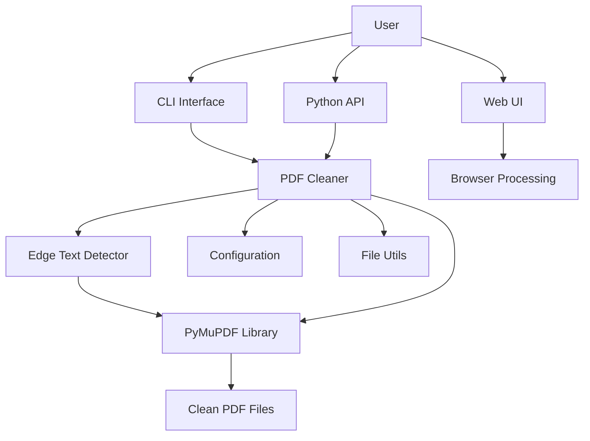
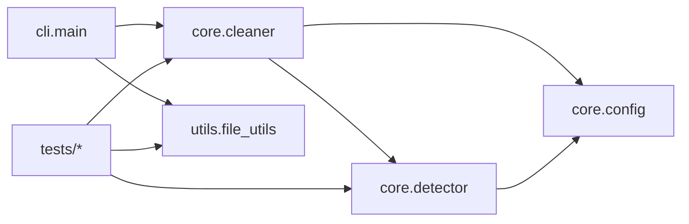
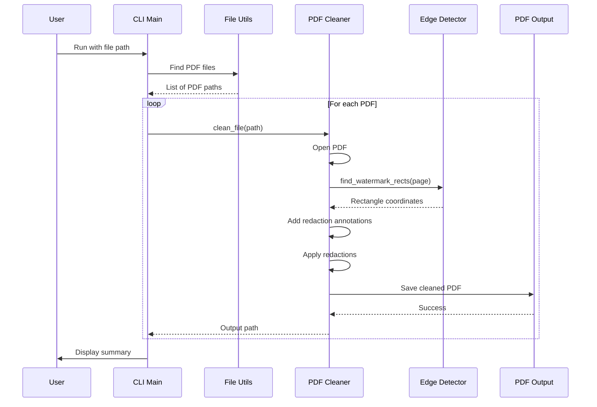
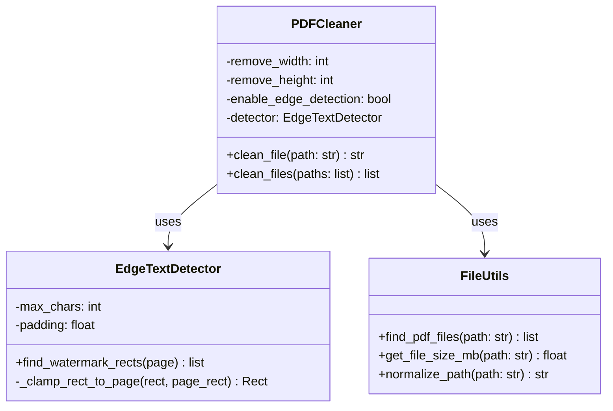
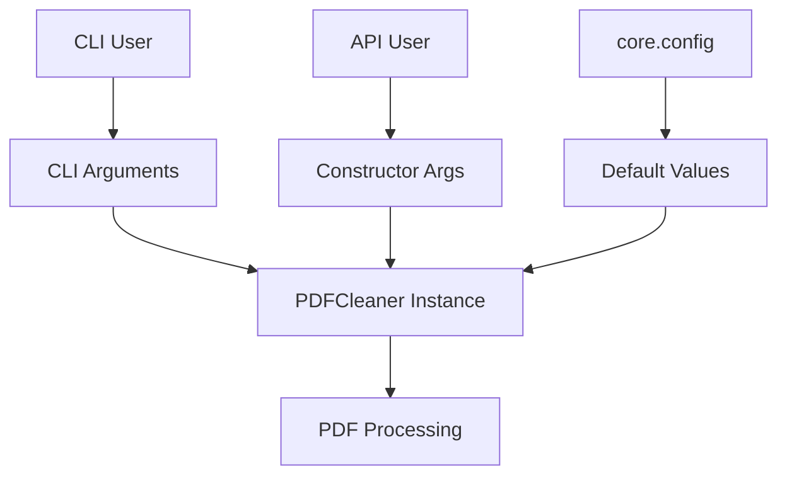
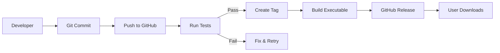
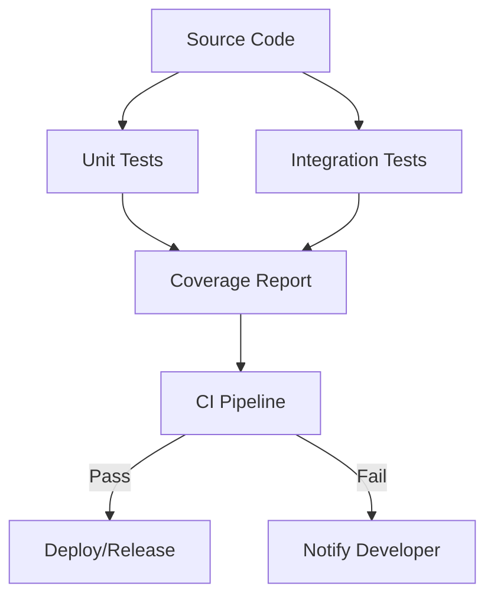

# ResumeUnmark Architecture

## System Overview



## Module Dependencies



## Data Flow



## Class Diagram



## Package Structure

```
src/
├── __init__.py                 # Package entry point
│   └── Exports: PDFCleaner, EdgeTextDetector, main
│
├── core/                       # Core watermark removal
│   ├── __init__.py
│   ├── cleaner.py             # PDFCleaner class
│   ├── detector.py            # EdgeTextDetector class
│   └── config.py              # Configuration constants
│
├── cli/                        # Command-line interface
│   ├── __init__.py
│   └── main.py                # CLI entry point
│
└── utils/                      # Utilities
    ├── __init__.py
    └── file_utils.py           # File operations
```

## Configuration Flow



## Build & Release Pipeline



## Testing Strategy



## User Interaction Models

### Desktop App

```
User → Drag & Drop → .exe → PDFCleaner → Output PDF
```

### Web UI

```
User → Upload → Browser Processing → Download Clean PDF
```

### Python API

```python
from src.core import PDFCleaner

cleaner = PDFCleaner()
cleaner.clean_file("document.pdf")
```

### CLI

```bash
python -m src.cli.main "document.pdf"
```

## Architecture Principles

1. **Separation of Concerns**: Each module has a single responsibility
2. **Open/Closed Principle**: Open for extension, closed for modification
3. **Dependency Injection**: Configuration passed via constructor
4. **DRY (Don't Repeat Yourself)**: Shared logic in utils
5. **Testability**: All components can be tested independently

## Extension Points

- **New Detection Algorithms**: Add to `core.detector`
- **New Output Formats**: Extend `core.cleaner`
- **New Interfaces**: Add to `src/` (e.g., GUI)
- **Custom Configurations**: Modify `core.config`
