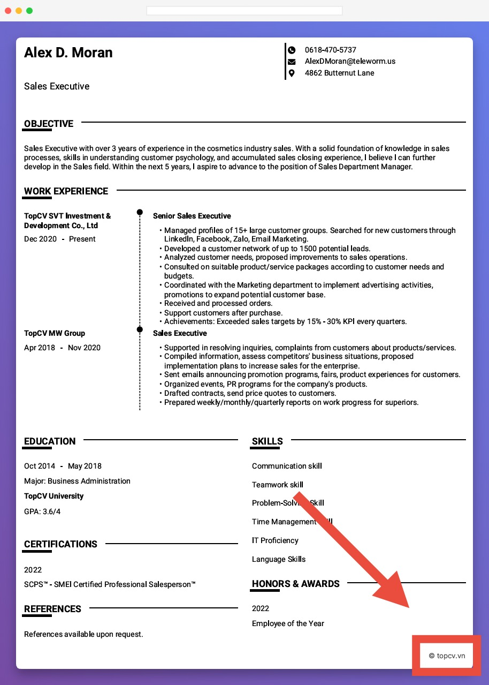
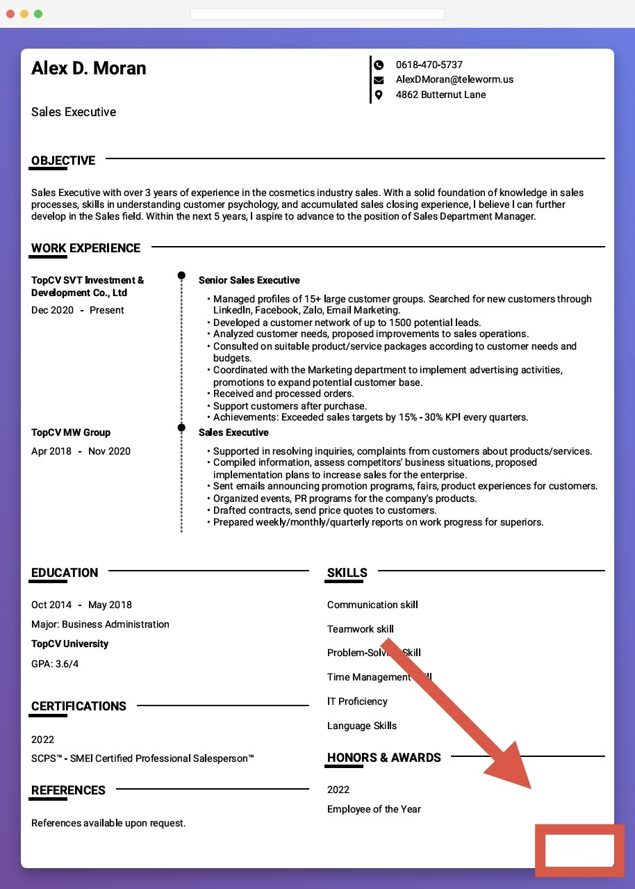

<div align="center">


# ResumeUnmark

**Remove watermarks from PDFs — locally, fast, and privacy-first.**

[](https://github.com/patrickzs/ResumeUnmark/releases)
[](LICENSE)
[](#-cli-python)

[Live Demo](https://patruxs.github.io/ResumeUnmark/) •
[How to Use](#-how-to-use) •
[Contributing](#-contributing)

</div>

---

## ✨ What It Does

Many resume sites add tiny logos or copyright text to exported PDFs. ResumeUnmark removes them using PDF redaction — no uploads, everything stays on your machine.

- 🧱 **Corner redaction** — clears a configurable bottom-right region
- 🧠 **Smart edge detection** — finds and removes isolated right-margin text
- � **Non-destructive** — outputs a new `*_clean.pdf`; originals stay untouched

|              Before               |              After              |
| :-------------------------------: | :-----------------------------: |
|  |  |

---

## � How to Use

### Web (No Install)

1. Open **[ResumeUnmark Web](https://patruxs.github.io/ResumeUnmark/)**
2. Drag & drop your PDF → Click **Clean & Download** → Done!

### CLI (Python)

```bash
git clone https://github.com/patrickzs/ResumeUnmark.git
cd ResumeUnmark
pip install -r requirements.txt

# Single file
python -m src.cli.main "resume.pdf"

# Batch folder
python -m src.cli.main "path/to/pdfs/"
```

---

## 🤝 Contributing

1. Fork → Branch (`git checkout -b feat/my-change`) → Commit → PR

```bash
pip install -r requirements-dev.txt
pytest -v && black --check src/ tests/ && flake8 src/ tests/ --max-line-length=100
```

---

## 📜 License

MIT — see [`LICENSE`](LICENSE).

Built with [PyMuPDF](https://pymupdf.readthedocs.io/), [pdf-lib](https://pdf-lib.js.org/), and [pdf.js](https://mozilla.github.io/pdf.js/).
